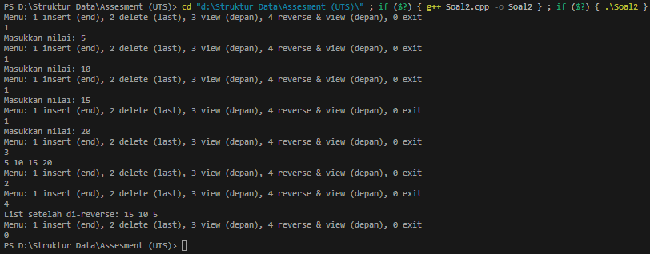

# Assesment (UTS) Soal 2 - Struktur Data

Identitas Pengumpul

Nama : Fakhri Naabil Prasetyo

NIM : 103112400274

Kelas : 12-IF-05

1. ## Kode Program

Berikut adalah kode program untuk mengimplementasikan Doubly Linked List, di mana list bisa ditambah dari belakang, dihapus dari belakang, dilihat dari depan, dan dibalik urutannya (reverse) yang memiliki fitur:

Insert nilai di akhir (end)

Delete nilai terakhir

Menampilkan list dari depan ke belakang

Reverse list tanpa membuat node baru


```
// Author : Fakhri Naabil Prasetyo
// NIM : 103112400274
// Deskripi : Program ini dibuat untuk mengimplementasikan struktur data Doubly Linked List, yaitu struktur list yang setiap nodenya memiliki dua pointer: satu menunjuk ke node berikutnya (next), dan satu lagi menunjuk ke node sebelumnya (prev).

#include <iostream>
using namespace std;

// Struktur Node pada Double Linked List
struct Node {
    int data;
    Node* next;
    Node* prev;
};

// Pointer awal dan akhir list
Node* head = NULL;
Node* tail = NULL;

// Fungsi Insert Akhir
void insertEnd(int nilai) {
    Node* baru = new Node();
    baru->data = nilai;
    baru->next = NULL;
    baru->prev = NULL;

    if (head == NULL) { 
        head = tail = baru;
    } else {
        tail->next = baru;
        baru->prev = tail;
        tail = baru;
    }
}

// Fungsi Delete Terakhir
void deleteLast() {
    if (tail == NULL) {
        return;
    }

    Node* hapus = tail;

    if (head == tail) { 
        head = tail = NULL;
    } else {
        tail = tail->prev;
        tail->next = NULL;
    }

    delete hapus;
}

// View Depan
void viewDepan() {
    Node* temp = head;
    while (temp != NULL) {
        cout << temp->data << " ";
        temp = temp->next;
    }
    cout << endl;
}

// Reverse List
void reverseList() {
    Node* sekarang = head;
    Node* sementara = NULL;

    while (sekarang != NULL) {
        sementara = sekarang->prev;
        sekarang->prev = sekarang->next;
        sekarang->next = sementara;
        sekarang = sekarang->prev;
    }

    if (sementara != NULL) {
        head = sementara->prev;
    }
}

// Reverse dan View
void reverseAndView() {
    reverseList();
    cout << "List setelah di-reverse: ";
    viewDepan();
}

// Program Utama 
int main() {
    int menu, nilai;

    do {
        cout << "Menu: 1 insert (end), 2 delete (last), 3 view (depan), 4 reverse & view (depan), 0 exit\n";
        cin >> menu;

        switch (menu) {
            case 1:
                cout << "Masukkan nilai: ";
                cin >> nilai;
                insertEnd(nilai);
                break;
            case 2:
                deleteLast();
                break;
            case 3:
                viewDepan();
                break;
            case 4:
                reverseAndView();
                break;
            case 0:
                break;
            default:
                cout << "Pilihan tidak ada!\n";
        }

    } while (menu != 0);

    return 0;
}
```


2. ## Penjelasan Kode

Berikut adalah penjelasan alur logika dari kode program di atas:

- ### Struktur Node  

Tiap Node memiliki :
1. data = Nilai integer
2. next = Penunjuk ke node setelahnya
3. prev = Penunjuk ke node sebelumnya
karena ada 2 arah pointer, list dapat diakses maju mundur.

- ### insertEnd()

Fungsi ini menambah data baru di belakang list.
Cara kerjanya:
Membuat node baru
Kalau list masih kosong, node langsung jadi head dan tail
Kalau sudah ada isi, node baru ditempelkan ke tail
Tail dipindahkan ke node yang baru.

- ### deleteLast()

Fungsinya menghapus node terakhir.
Ada beberapa kondisi:
Kalau list kosong → tidak melakukan apa-apa
Kalau hanya ada 1 node → head dan tail jadi NULL
Kalau node lebih dari 1 → tail digeser ke node sebelumnya, node lama dihapus.

- ### viewDepan()

Menampilkan isi list dari depan.
Mulai dari head → maju terus mengikuti next sampai NULL.

- ### reverseList()

Bagian ini membalik list tanpa membuat node baru.
Untuk tiap node:
pointer prev ditukar dengan next
setelah semuanya tertukar, head dipindah ke posisi yang seharusnya.

- ### reverseAndView()

Pertama melakukan reverse, lalu menampilkan hasilnya.


3. ## Output Program

Berikut adalah hasil eksekusi program (output) ketika dijalankan.




4. ## Penjelasan Lanjutan (Analisis Output)

Berikut penjelasan kenapa output tersebut benar :

Saat user memasukkan 5, 10, 15, 20, data dimasukkan berurutan ke belakang.

Saat ditampilkan, listnya adalah:

5 10 15 20

Setelah deleteLast, angka 20 dihapus.

Saat dilakukan reverse, urutannya otomatis terbalik menjadi:

15 10 5

Saat ditampilkan kembali, nilai sudah tersusun seperti hasil reverse.

Program bekerja sesuai operasi yang ada pada Doubly Linked List.


5. ## Kesimpulan

Dari pembuatan dan pengujian program Doubly Linked List ini, bisa disimpulkan bahwa:

Doubly Linked List fleksibel karena bisa bergerak dua arah dan memudahkan operasi pada ujung list.

Operasi insert, delete, view, dan reverse dapat dibuat dengan memanfaatkan pointer prev dan next.

Program telah berjalan sesuai dengan yang diminta pada soal, dan seluruh fungsinya bekerja dengan benar.
