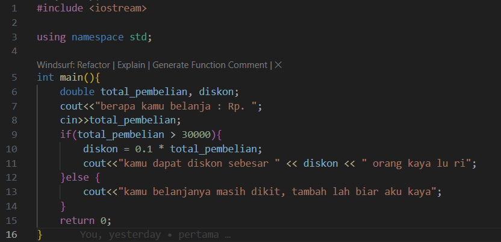
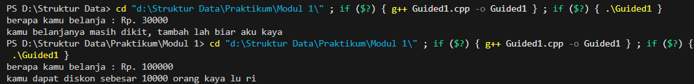
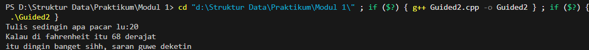
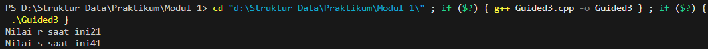
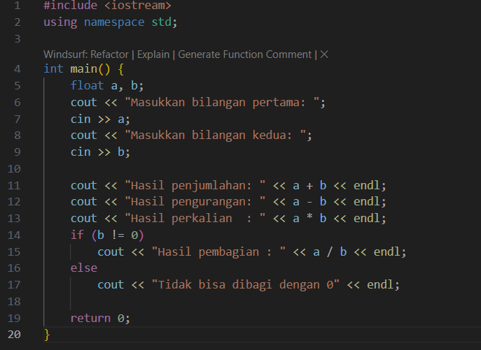
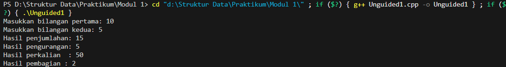
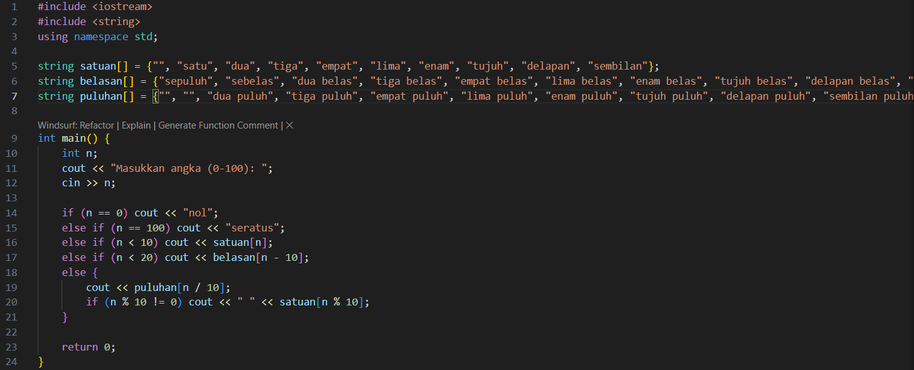
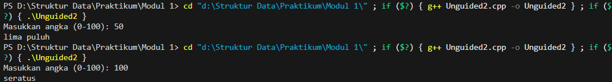
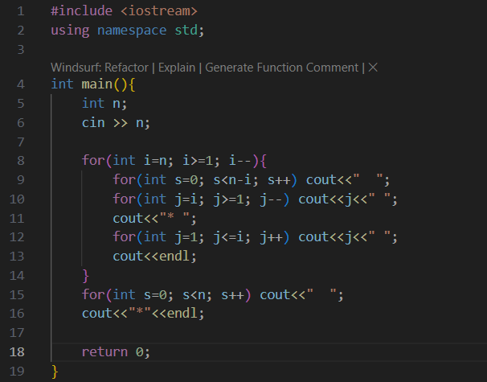
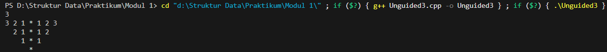

# Laporan Praktikum Struktur Data Modul 1

## 1. Nama, NIM, Kelas
- **Nama** : Fakhri Naabil Prasetyo
- **NIM**  : 103112400274
- **Kelas**: 12-IF-05

## 2. Motivasi Belajar Struktur Data
Saya memiliki dorongan kuat untuk mempelajari struktur data karena menyadari bahwa konsep ini adalah dasar utama dalam pemrograman. Seperti halnya bangunan yang membutuhkan fondasi kokoh, program yang kita buat juga membutuhkan struktur data agar dapat berjalan dengan baik.

## 3. Dasar Teori
Struktur data adalah cara bagaimana komputer menyimpan, mengatur, dan mengolah data agar dapat digunakan secara efisien. Tanpa adanya struktur data, sebuah program akan sulit bekerja dengan baik karena data tidak terorganisir dengan benar. Dengan memahami struktur data, kita bisa merancang program yang lebih cepat, hemat memori, dan mudah dikembangkan. Berikut adalah teori dasar mengenai **Graf** dan **Pohon**:

- **Graf**: Graf adalah struktur data yang dipakai untuk merepresentasikan keterhubungan antar elemen. Elemen yang ada disebut simpul (vertex), sedangkan penghubung antar simpul disebut sisi atau busur (edge). Graf banyak dimanfaatkan untuk menggambarkan jaringan, rute, atau hubungan dalam suatu sistem.
- **Pohon**: Pohon adalah struktur data yang memiliki bentuk hierarki. Di dalamnya terdapat simpul-simpul yang saling terhubung, dengan satu simpul utama sebagai akar (root). Dari akar ini, data bercabang ke simpul lain, sehingga pohon sering digunakan dalam representasi sistem berlapis seperti folder komputer atau algoritma pencarian.

## 4. Guided
### 4.1 Guided 1

Program ini berfungsi untuk menghitung potongan harga dari total belanja yang dimasukkan oleh pengguna. Pertama, program meminta pengguna memasukkan jumlah total belanja, kemudian menyimpannya ke dalam variabel total_pembelian. Setelah itu, dilakukan pengecekan menggunakan kondisi if-else. Jika total belanja sama dengan atau lebih dari Rp30.000, maka pengguna akan mendapat diskon 10%. Besarnya diskon dihitung dengan rumus: diskon = 0.1 * total_pembelian
Hasil perhitungan diskon tersebut kemudian ditampilkan ke layar.
Sebaliknya, jika total belanja kurang dari Rp30.000, program akan menampilkan pesan bahwa jumlah belanja masih belum memenuhi syarat untuk mendapatkan diskon.

Output  :

### 4.2 Guided 2

Program ini dibuat untuk mengubah suhu dari Celcius menjadi Fahrenheit. Pertama, program menyiapkan dua variabel bertipe float: celcius untuk menampung input suhu dari pengguna, dan fahrenheit untuk menyimpan hasil konversi.
Selanjutnya, program menampilkan pesan di layar agar pengguna memasukkan suhu dalam satuan Celcius. Nilai yang dimasukkan kemudian disimpan ke dalam variabel celcius.

Output  :

### 4.3 Guided 3

Program ini dibuat untuk memperlihatkan bagaimana cara kerja operator increment prefix pada sebuah variabel.
Pertama, sebuah variabel diberi nilai awal 20, lalu ada variabel lain yang disiapkan untuk menampung hasil perhitungan. Setelah itu dilakukan operasi penjumlahan antara angka 20 dengan variabel yang sudah dinaikkan nilainya terlebih dahulu. Karena menggunakan increment prefix, nilai variabel tersebut ditambah satu lebih dulu sebelum dipakai dalam perhitungan. Akibatnya, variabel pertama yang awalnya bernilai 20 berubah menjadi 21. Hasil penjumlahan yang dilakukan kemudian menghasilkan nilai 41 dan disimpan di variabel kedua. Pada akhir program, kedua nilai tersebut ditampilkan ke layar.

Output  :

## 5. Unguided
### 5.1 Unguided 1

Program ini dibuat untuk menerima dua bilangan desimal dari pengguna. Setelah kedua bilangan dimasukkan, program akan menghitung hasil penjumlahan, pengurangan, perkalian, dan pembagian dari bilangan tersebut. Jika bilangan kedua bernilai nol, maka program menampilkan pesan bahwa pembagian tidak bisa dilakukan. Tujuan dari program ini adalah memperlihatkan penggunaan operasi aritmatika dasar pada dua input angka.

Output  :

### 5.2 Unguided 2

Program ini menerima sebuah bilangan bulat dari pengguna dengan batas antara 0 sampai 100. Setelah itu, program akan mengubah angka tersebut menjadi bentuk tulisan dalam bahasa Indonesia. Untuk angka 0, hasilnya adalah "nol", sedangkan angka 100 menjadi "seratus". Angka kurang dari 10 ditampilkan langsung sesuai satuannya, angka antara 10 hingga 19 ditampilkan dalam bentuk belasan, sedangkan angka 20 sampai 99 ditampilkan sebagai gabungan antara puluhan dan satuan. Dengan demikian, program ini membantu mengubah angka menjadi bentuk kata.

Output  :

### 5.3 Unguided 3

Program ini meminta input sebuah bilangan bulat positif dari pengguna. Setelah input diberikan, program akan mencetak sebuah pola berbentuk cermin (mirror) dari angka-angka. Angka dicetak menurun dari nilai input sampai angka satu di sebelah kiri, kemudian ditampilkan simbol bintang di tengah, dan setelah itu angka dicetak naik dari satu sampai nilai input di sebelah kanan. Proses ini diulang hingga baris terakhir hanya berisi angka satu, bintang, dan angka satu. Program ini menunjukkan bagaimana penggunaan perulangan bersarang dapat menghasilkan pola tertentu di layar.

Output  :

## 6. Kesimpulan
Kesimpulannya, dari semua program yang sudah dibuat dan dipelajari, saya jadi lebih paham bagaimana dasar-dasar pemrograman C++ bisa dipakai untuk menyelesaikan berbagai persoalan sederhana. Mulai dari program menghitung diskon, mengubah suhu, operasi aritmatika, penggunaan increment, sampai mengolah angka menjadi tulisan atau pola, semuanya memperlihatkan bahwa logika pemrograman saling berkaitan satu sama lain. Bagian penting yang sering dipakai adalah input-output, percabangan if-else, perulangan for, dan juga array. Dengan sering berlatih membuat program kecil seperti ini, saya semakin sadar kalau penguasaan konsep dasar itu sangat penting sebelum mempelajari materi yang lebih sulit, misalnya struktur data atau algoritma. Selain itu, saya juga menyadari bahwa menyusun logika dengan kreatif bisa membuat program lebih jelas dan mudah dimengerti. Jadi, belajar materi ini bukan hanya melatih cara menulis kode, tetapi juga membiasakan diri berpikir secara runtut dan terstruktur dalam mencari solusi.

## 7. Referensi
1. Bagus, I., & Udayana, I. (2018). Pengantar dan Pengenalan Konsep Dasar Algoritma Pemrograman. Jurnal Ilmiah Pendidikan Teknik Informatika, 9(1).
2. Tutorialspoint. “C++ Programming Language.” https://www.tutorialspoint.com/cplusplus/