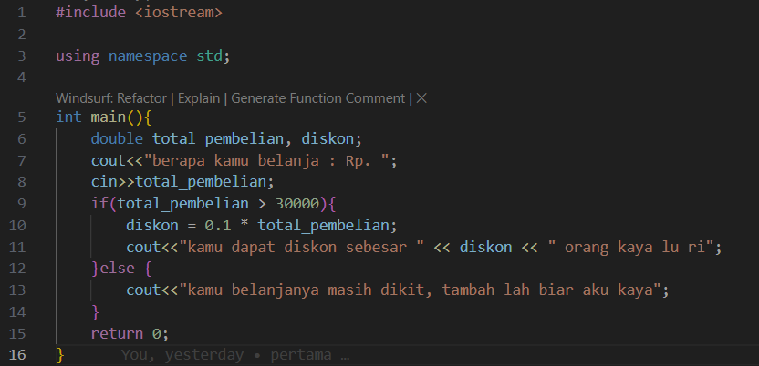
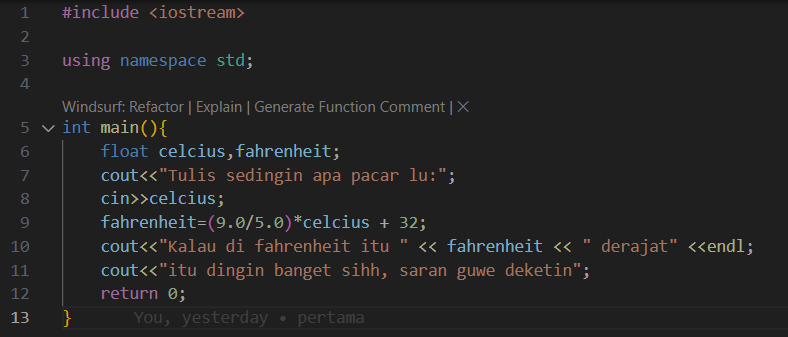
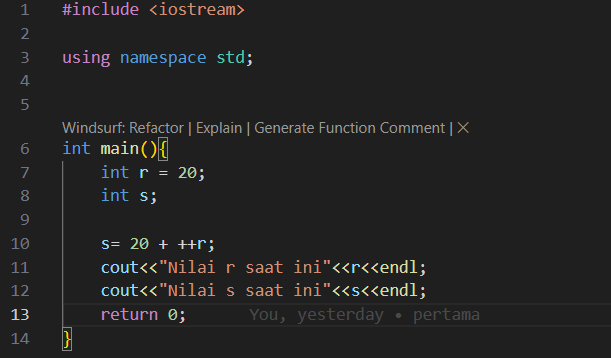

# Laporan Praktikum Struktur Data

## 1. Nama, NIM, Kelas
- **Nama** : Fakhri Naabil Prasetyo
- **NIM**  : 103112400274
- **Kelas**: 12-IF-05

## 2. Motivasi Belajar Struktur Data
Saya memiliki dorongan kuat untuk mempelajari struktur data karena menyadari bahwa konsep ini adalah dasar utama dalam pemrograman. Seperti halnya bangunan yang membutuhkan fondasi kokoh, program yang kita buat juga membutuhkan struktur data agar dapat berjalan dengan baik.

## 3. Dasar Teori
Struktur data adalah cara bagaimana komputer menyimpan, mengatur, dan mengolah data agar dapat digunakan secara efisien. Tanpa adanya struktur data, sebuah program akan sulit bekerja dengan baik karena data tidak terorganisir dengan benar. Dengan memahami struktur data, kita bisa merancang program yang lebih cepat, hemat memori, dan mudah dikembangkan. Berikut adalah teori dasar mengenai **Graf** dan **Pohon**:

- **Graf**: Graf adalah struktur data yang dipakai untuk merepresentasikan keterhubungan antar elemen. Elemen yang ada disebut simpul (vertex), sedangkan penghubung antar simpul disebut sisi atau busur (edge). Graf banyak dimanfaatkan untuk menggambarkan jaringan, rute, atau hubungan dalam suatu sistem.
- **Pohon**: Pohon adalah struktur data yang memiliki bentuk hierarki. Di dalamnya terdapat simpul-simpul yang saling terhubung, dengan satu simpul utama sebagai akar (root). Dari akar ini, data bercabang ke simpul lain, sehingga pohon sering digunakan dalam representasi sistem berlapis seperti folder komputer atau algoritma pencarian.

## 4. Guided
### 4.1 Guided 1

Program ini berfungsi untuk menghitung potongan harga dari total belanja yang dimasukkan oleh pengguna. Pertama, program meminta pengguna memasukkan jumlah total belanja, kemudian menyimpannya ke dalam variabel total_pembelian. Setelah itu, dilakukan pengecekan menggunakan kondisi if-else. Jika total belanja sama dengan atau lebih dari Rp30.000, maka pengguna akan mendapat diskon 10%. Besarnya diskon dihitung dengan rumus: diskon = 0.1 * total_pembelian
Hasil perhitungan diskon tersebut kemudian ditampilkan ke layar.
Sebaliknya, jika total belanja kurang dari Rp30.000, program akan menampilkan pesan bahwa jumlah belanja masih belum memenuhi syarat untuk mendapatkan diskon.

Output

### 4.2 Guided 2

[Penjelasan tentang guided kedua, meliputi kode dan penjelasan fungsinya.]

### 4.3 Guided 3

[Penjelasan tentang guided ketiga yang sesuai dengan praktikum yang telah dilakukan.]

## 5. Unguided
### 5.1 Unguided 1
[Penjelasan tentang unguided pertama, termasuk kode yang telah diimplementasikan oleh Anda.]

### 5.2 Unguided 2
[Penjelasan tentang unguided kedua, termasuk kode dan cara implementasinya.]

### 5.3 Unguided 3
[Penjelasan tentang unguided ketiga, termasuk aplikasi atau pengembangan lebih lanjut yang Anda lakukan.]

## 6. Kesimpulan
[Isi dengan kesimpulan dari seluruh praktikum ini, apakah tujuan praktikum tercapai, dan bagaimana Anda mengimplementasikan dan memahami teori yang dipelajari.]

## 7. Referensi
1. [Buku atau artikel yang Anda gunakan untuk referensi, jika ada]
2. [Sumber lain yang relevan dengan topik praktikum ini]