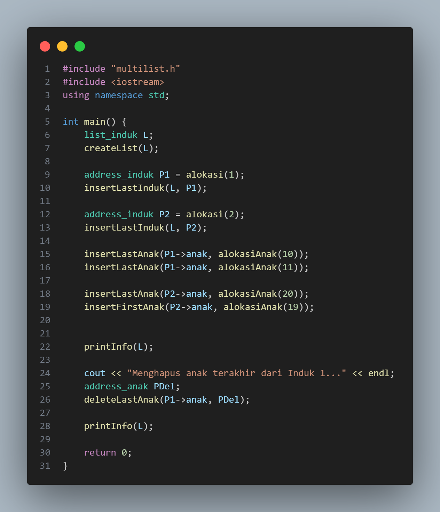
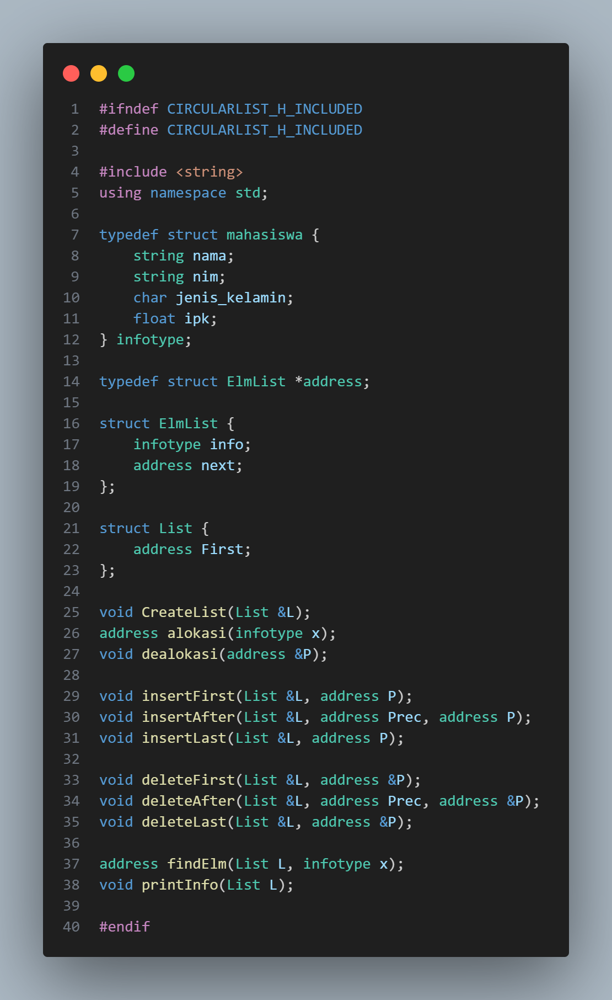
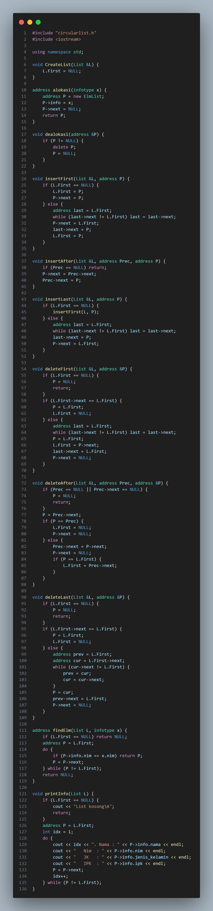

# Laporan Praktikum Struktur Data Modul 13

## 1. Nama, NIM, Kelas
- **Nama** : Fakhri Naabil Prasetyo
- **NIM**  : 103112400274
- **Kelas**: 12-IF-05

## 2. Motivasi Belajar Struktur Data
Saya memiliki dorongan kuat untuk mempelajari struktur data karena menyadari bahwa konsep ini adalah dasar utama dalam pemrograman. Seperti halnya bangunan yang membutuhkan fondasi kokoh, program yang kita buat juga membutuhkan struktur data agar dapat berjalan dengan baik.

## 3. Dasar Teori
Struktur data merupakan cara mengorganisir, menyimpan, dan mengelola data di dalam komputer agar proses pemrosesan dapat dilakukan lebih cepat dan efisien. Pemilihan struktur data yang tepat sangat penting karena memengaruhi performa operasi seperti pencarian, penambahan, hingga penghapusan data. Dua struktur yang sering digunakan untuk memodelkan data bertingkat maupun data yang berulang adalah Multi Linked List dan Circular Linked List.

### Berikut adalah Dasar Teori nya  :

1. Multi Linked List

Multi Linked List adalah struktur data dinamis yang terdiri dari beberapa linked list yang saling berhubungan dalam pola parent–child. Setiap node pada List Induk memiliki pointer tambahan untuk mengarah ke List Anak, sehingga setiap elemen induk dapat memiliki kumpulan data turunan yang berbeda-beda. Dengan demikian, struktur ini cocok digunakan untuk data yang memiliki relasi hierarkis.
Pada studi kasus data Pegawai, List Induk berisi data pegawai, sedangkan List Anak berisi data-data terkait seperti bagian, jabatan, atau daftar informasi lain yang hanya dimiliki oleh pegawai tertentu. Implementasinya biasanya menggunakan Doubly Linked List, sehingga setiap node memiliki pointer next dan prev untuk memudahkan penelusuran maju maupun mundur.
Karena terdiri dari beberapa tingkatan, operasi pada Multi Linked List harus memperhatikan keterhubungan antar-list. Misalnya, ketika sebuah node induk dihapus, maka seluruh data anak yang terhubung dengannya juga perlu dihapus agar tidak terjadi data yatim atau memory leak. Struktur ini fleksibel, tetapi membutuhkan penanganan memori yang lebih teliti.

2. Circular Linked List

Circular Linked List merupakan variasi dari linked list yang membentuk struktur melingkar. Node terakhir tidak menunjuk ke NULL, tetapi kembali ke node pertama, sehingga daftarnya tidak memiliki titik akhir. Kondisi ini mempermudah proses traversal yang membutuhkan perputaran data secara terus-menerus.
Dalam studi kasus data Mahasiswa, Circular Linked List digunakan untuk menyimpan data seperti Nama, NIM, Jenis Kelamin, dan IPK. Pada saat penelusuran, pointer next akan terus mengikuti node berikutnya hingga kembali ke node awal, menandakan bahwa seluruh elemen telah dilewati.
Circular Linked List sangat bermanfaat pada aplikasi yang memerlukan alur yang berulang, seperti antrian berputar, sistem giliran, atau pemrosesan yang perlu kembali ke awal tanpa harus mengatur ulang pointer secara manual. Meskipun sederhana, struktur ini perlu diimplementasikan dengan hati-hati agar tidak terjadi infinite loop selama traversal.

## 4. Guided
### 4.1 Guided 1 (multilist.h)
.png)

- **Penjelasan  :**
File multilist.h merupakan header yang berisi definisi struktur data dan deklarasi fungsi untuk membangun sebuah Multi Linked List, yaitu list induk yang masing-masing elemennya memiliki list anak sendiri. Pada bagian awal, file ini dilindungi dengan header guard agar tidak di-include lebih dari sekali, kemudian memanggil pustaka <iostream>, dan mendefinisikan Nil sebagai alias dari NULL. Terdapat juga typedef yang menyederhanakan penulisan tipe data, seperti infotype untuk data yang disimpan serta address_induk dan address_anak untuk pointer ke node induk dan anak.
Struktur elemen anak disusun sebagai doubly linked list, di mana setiap node memiliki data (info) serta pointer next dan prev. Untuk mengelola kumpulan anak, disediakan struktur list_anak yang menyimpan pointer ke node pertama dan terakhir. Struktur induk juga menggunakan konsep doubly linked list yang memiliki info, pointer next dan prev, serta sebuah list_anak untuk menampung data anak milik induk tersebut. Dengan demikian, setiap induk dapat memiliki list anak yang berbeda-beda, sesuai konsep Multi Linked List.

### 4.2 Guided 2 (multilist.cpp)
.png)

- **Penjelasan  :**
File multilist.cpp berisi implementasi fungsi-fungsi untuk mengelola struktur Multi Linked List. Fungsi pertama, createList, menginisialisasi list induk dengan menjadikan first dan last bernilai Nil sehingga list berada dalam kondisi kosong. Fungsi alokasi kemudian membuat node induk baru, mengisi nilai informasinya, mengatur pointer next dan prev, serta menyiapkan list anak di dalam node tersebut agar kosong.
Fungsi-fungsi penyisipan disusun mulai dari insertLastInduk yang menambahkan node induk di bagian belakang list. Jika list kosong, node langsung menjadi elemen pertama dan terakhir; jika tidak, node baru dihubungkan ke elemen terakhir sebelumnya dan pointer last diperbarui. insertFirstInduk bekerja pada bagian depan list dengan cara yang sama, yaitu menjadikan node baru sebagai elemen pertama. Fungsi insertAfterInduk digunakan untuk menyisipkan node setelah elemen tertentu, dengan melakukan pengaturan ulang pointer next dan prev di sekitar posisi sisipan.
Penghapusan elemen dilakukan melalui deleteFirstInduk untuk menghapus elemen paling depan dan deleteLastInduk untuk menghapus elemen paling belakang. Keduanya menangani kondisi khusus saat jumlah elemen hanya satu maupun saat list berisi banyak node, lalu melepaskan node terkait dengan memastikan pointer sudah tidak saling terhubung. Untuk pencarian, fungsi findInduk menelusuri list dari awal hingga menemukan elemen dengan nilai informasi tertentu atau mencapai akhir list.

### 4.2 Guided 3 (multilist_anak.cpp)
.png)

- **Penjelasan  :**
Kode ini berisi fungsi-fungsi yang digunakan untuk mengelola list anak pada struktur multilist. Pertama, fungsi alokasiAnak digunakan untuk membuat node anak baru. Di dalamnya, sebuah elemen baru dialokasikan, kemudian nilai informasinya diisi dengan data yang diberikan. Pointer next dan prev diset menjadi Nil, lalu node tersebut dikembalikan sebagai hasil alokasi.
Selanjutnya, fungsi insertFirstAnak bertugas menambahkan node anak di bagian paling depan list. Jika list masih kosong, node tersebut langsung menjadi elemen pertama sekaligus terakhir. Namun bila list sudah memiliki elemen, node baru dihubungkan ke elemen pertama lama, pointer prev dari elemen lama diperbarui, dan node baru kemudian dijadikan elemen pertama.
Fungsi berikutnya adalah insertLastAnak, yang menambahkan node di bagian paling belakang. Jika list kosong, fungsi ini cukup memanggil insertFirstAnak. Jika tidak kosong, node baru disambungkan ke elemen terakhir, pointer-pointer disesuaikan, lalu node tersebut ditandai sebagai elemen terakhir yang baru.
Untuk penghapusan, fungsi deleteFirstAnak digunakan untuk menghapus elemen pertama list. Apabila di dalam list hanya ada satu elemen, maka list dikosongkan sepenuhnya. Jika lebih dari satu elemen, pointer first digeser ke node berikutnya, pointer prev pada node baru pertama dibersihkan, dan pointer next dari node yang dihapus di-reset ke Nil.

### 4.2 Guided 4 (main.cpp)
.png)

- **Penjelasan  :**
Kode pada fungsi main() digunakan untuk menguji operasi dasar pada struktur multilist. Program dimulai dengan membuat list induk L dan menginisialisasinya menggunakan createList(). Selanjutnya dibuat node induk pertama (P1) bernilai 1, lalu dimasukkan ke list menggunakan insertLastInduk(). Kemudian dibuat node anak (PA1) bernilai 10 dan ditambahkan sebagai anak dari induk pertama melalui insertLastAnak().
Setelah itu, program membuat induk kedua (P2) bernilai 2 dan menambahkannya ke list induk. Node anak kedua (PA2) bernilai 20 juga dibuat dan dimasukkan sebagai anak dari induk kedua. Pada akhir program, fungsi printInfo(L) dipanggil untuk menampilkan seluruh data induk beserta anak-anaknya. Program ditutup dengan return 0.

- **Output Compile main.cpp :**

.png)

## 5. Unguided
### 5.1 Unguided 1

- **Penjelasan  :**
Program ini menggunakan struktur multilist, yaitu sebuah list induk yang setiap elemennya memiliki list anak. Di dalam fungsi main(), pertama-tama dibuat sebuah list induk bernama L dengan memanggil createList(L) agar list tersebut siap digunakan.
Setelah itu, dibuat dua node induk: P1 dengan data 1, dan P2 dengan data 2, melalui fungsi alokasi(). Kedua node induk ini kemudian dimasukkan ke dalam list induk menggunakan insertLastInduk, sehingga P1 dan P2 tersusun dalam list.
Berikutnya, untuk induk pertama (P1), program menambahkan dua anak di bagian akhir list anak, yaitu anak dengan nilai 10 dan 11. Untuk induk kedua (P2), program menambahkan anak bernilai 20 di bagian akhir, dan satu anak lainnya bernilai 19 di bagian awal list anak P2.
Setelah semua elemen dimasukkan, fungsi printInfo(L) dipanggil untuk menampilkan seluruh data induk beserta anak-anaknya.
Kemudian program menampilkan pesan bahwa anak terakhir dari induk pertama akan dihapus. Sebuah variabel PDel disiapkan untuk menampung alamat anak yang dihapus. Proses penghapusan dilakukan menggunakan deleteLastAnak(P1->anak, PDel), yaitu menghapus elemen anak yang berada di posisi paling akhir pada induk pertama.
Setelah penghapusan selesai, program kembali memanggil printInfo(L) untuk menampilkan kondisi multilist setelah perubahan. Akhirnya program mengembalikan nilai 0 sebagai tanda bahwa program berakhir dengan normal.

- **Output  :**

### 5.2 Unguided 2
#### circularlist.h

- **Penjelasan  :**
Kode tersebut mendefinisikan sebuah struktur data untuk membuat circular linked list yang menyimpan informasi mahasiswa. Di dalamnya terdapat tipe data mahasiswa yang menyimpan nama, NIM, jenis kelamin, dan IPK, kemudian setiap elemen list direpresentasikan oleh ElmList yang berisi data mahasiswa dan pointer ke elemen berikutnya. Struktur List dibuat untuk menyimpan pointer ke elemen pertama dalam list. Selain itu, kode ini juga mendeklarasikan berbagai fungsi untuk mengelola list, seperti fungsi untuk membuat list baru, mengalokasikan dan menghapus node, menambahkan elemen di awal, setelah elemen tertentu, atau di akhir list, menghapus elemen dari berbagai posisi, mencari elemen berdasarkan data tertentu, serta menampilkan seluruh isi list. Secara keseluruhan, header file ini berfungsi sebagai rancangan dasar yang menyediakan struktur dan prototipe fungsi yang diperlukan untuk memanipulasi circular linked list berisi data mahasiswa.

#### circularlist.cpp

- **Penjelasan  :**
Kode ini berisi implementasi circular linked list untuk menyimpan data mahasiswa. Fungsi CreateList membuat list kosong, sementara alokasi dan dealokasi digunakan untuk membuat serta menghapus node. Operasi insertFirst, insertAfter, dan insertLast menambahkan node ke awal, setelah node tertentu, atau di akhir list dengan tetap menjaga bentuk list melingkar. Sebaliknya, deleteFirst, deleteAfter, dan deleteLast menghapus node dari berbagai posisi. Fungsi findElm mencari data mahasiswa berdasarkan NIM, dan printInfo menampilkan seluruh isi list atau memberi pesan jika list kosong. Secara keseluruhan, kode ini menyediakan fungsi dasar untuk membuat, memodifikasi, mencari, dan menampilkan circular linked list.

#### Unguided 2

- **Penjelasan  :**
Kode ini merupakan implementasi berbagai operasi pada ADT Circular Linked List untuk menyimpan data mahasiswa. List diawali dalam keadaan kosong melalui CreateList, kemudian node baru dibentuk menggunakan alokasi dan dihapus dengan dealokasi. Operasi penyisipan seperti insertFirst, insertAfter, dan insertLast digunakan untuk menambah elemen pada awal, setelah elemen tertentu, atau di akhir list sambil tetap mempertahankan struktur circular. Operasi penghapusan—deleteFirst, deleteAfter, dan deleteLast—menghapus node dari berbagai posisi dan menyesuaikan kembali hubungan antar elemen. Fungsi findElm berfungsi mencari node berdasarkan NIM, sedangkan printInfo menampilkan seluruh isi list secara berurutan hingga kembali ke elemen pertama. Secara ringkas, kode ini menunjukkan cara membangun, menambah, menghapus, mencari, dan menampilkan data pada circular linked list.

- **Output  :**

## 6. Kesimpulan
Berdasarkan hasil implementasi dan pemahaman terhadap program Circular Linked List tersebut, dapat disimpulkan bahwa tujuan pembelajaran mengenai pengelolaan struktur data dinamis telah tercapai. Melalui penggunaan fungsi-fungsi seperti insertFirst, insertAfter, insertLast, deleteFirst, deleteAfter, deleteLast, dan findElm, saya dapat memahami cara kerja pengaturan node yang saling terhubung menggunakan pointer. Circular Linked List memiliki ciri khas berupa elemen terakhir yang selalu menunjuk kembali ke elemen pertama, sehingga membentuk rangkaian melingkar yang memudahkan proses traversal dan menjamin tidak adanya titik akhir selama penelusuran. Struktur ini juga memberikan kelebihan dalam operasi penambahan dan penghapusan elemen karena tidak memerlukan pergeseran data seperti pada array. Pemisahan fungsi dalam file header dan file implementasi menjadikan program lebih rapi, modular, dan mudah dipelajari. Secara keseluruhan, praktikum ini memperkuat pemahaman saya mengenai konsep dasar, operasi penting, serta penerapan Circular Linked List dalam pemrograman C++.

## 7. Referensi
1. Programiz. “Circular Linked List – Insertion and Deletion.” (https://www.programiz.com/dsa/circular-linked-list)
2. Wahyuni, S. dan Purnomo, A., 2020. 'Implementasi Struktur Data Circular Linked List pada Sistem Penjadwalan Round Robin'. Jurnal Teknologi Informasi dan Ilmu Komputer (JTIIK), 5(3), pp. 200–208.
3. Goodrich, M. T., Tamassia, R., & Mount, D. (2011). Data Structures and Algorithms in C++. Wiley.