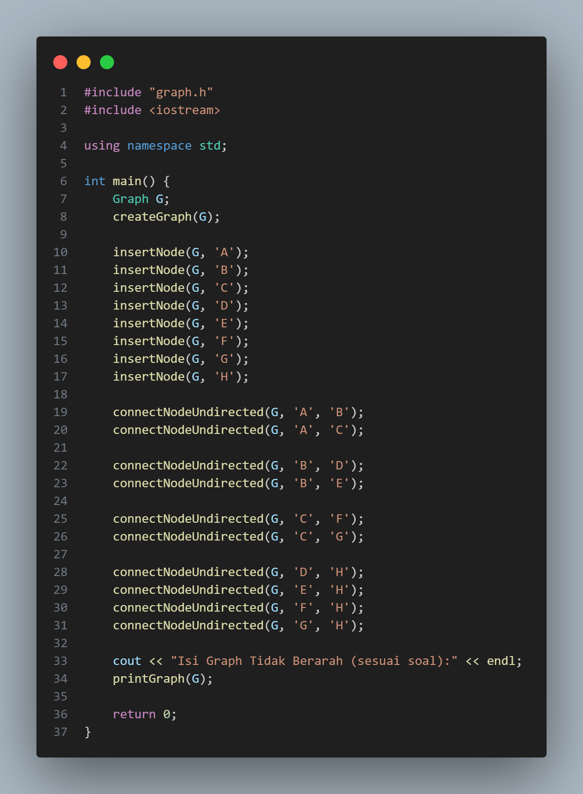
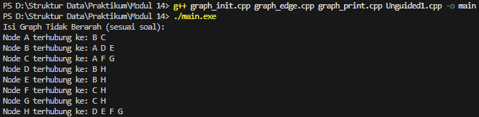
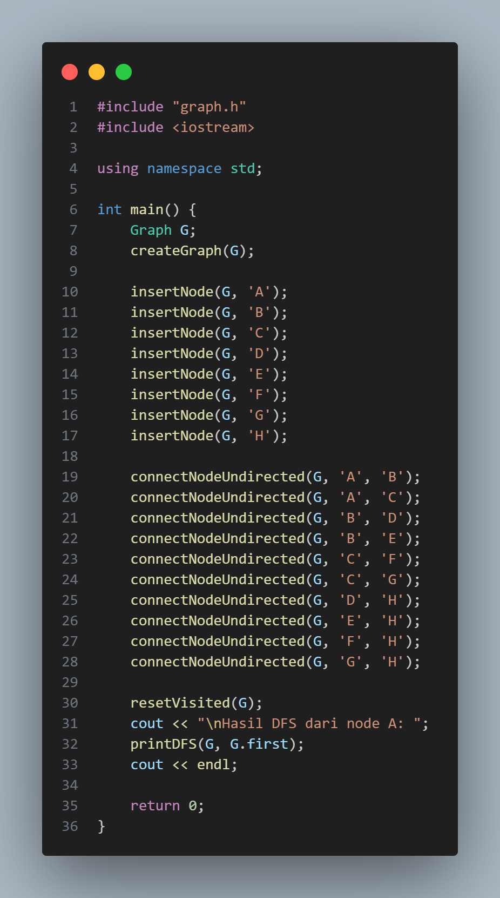
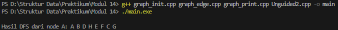
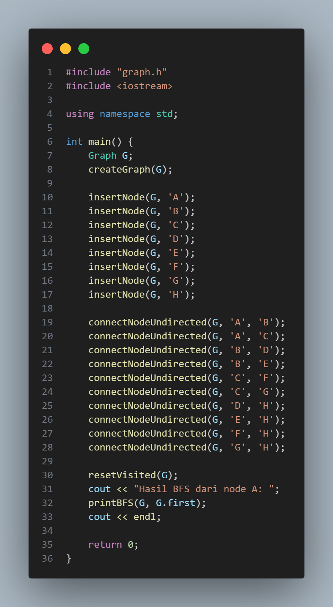
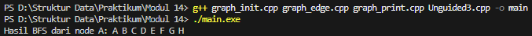

# Laporan Praktikum Struktur Data Modul 14

## 1. Nama, NIM, Kelas
- **Nama** : Fakhri Naabil Prasetyo
- **NIM**  : 103112400274
- **Kelas**: 12-IF-05

## 2. Motivasi Belajar Struktur Data
Saya memiliki dorongan kuat untuk mempelajari struktur data karena menyadari bahwa konsep ini adalah dasar utama dalam pemrograman. Seperti halnya bangunan yang membutuhkan fondasi kokoh, program yang kita buat juga membutuhkan struktur data agar dapat berjalan dengan baik.

## 3. Dasar Teori
Struktur data merupakan cara untuk menyimpan dan mengelola data agar dapat digunakan secara efisien. Pada praktikum ini digunakan struktur data Graph yang direpresentasikan menggunakan Adjacency List berbasis linked list, karena efektif dalam memodelkan hubungan antar data seperti jaringan komputer, peta, dan keterkaitan antar objek.

Graph terdiri dari kumpulan node (vertex) dan edge yang menunjukkan hubungan antar node, dan dinotasikan sebagai G = (V, E). Praktikum ini menggunakan graph tidak berarah (undirected graph), di mana setiap hubungan bersifat dua arah. Jika suatu node terhubung ke node lain, maka node tersebut juga terhubung kembali.
Representasi adjacency list menyimpan setiap node beserta daftar node tetangganya. Cara ini lebih hemat memori dibandingkan adjacency matrix dan memudahkan proses traversal. Graph dibangun menggunakan struktur node dan edge, di mana node menyimpan data, status kunjungan (visited), serta pointer ke edge dan node berikutnya.
Traversal graph digunakan untuk mengunjungi seluruh node tanpa pengulangan dengan memanfaatkan atribut visited. Metode traversal yang digunakan adalah Depth First Search (DFS) dan Breadth First Search (BFS). DFS menelusuri graph secara mendalam, sedangkan BFS menelusuri secara melebar berdasarkan level dengan bantuan struktur data queue. Sebelum traversal dilakukan, status visited di-reset agar hasil penelusuran tetap benar. Program disusun secara modular agar lebih terstruktur dan mudah dikembangkan.

## 4. Guided
### 4.1 Guided 1 (graph.h)
.png)

- **Penjelasan  :**
File graph.h digunakan sebagai file header yang berisi definisi struktur data dan deklarasi komponen utama untuk membangun sebuah graf dengan pendekatan adjacency list. Di dalam file ini didefinisikan beberapa struktur penting, seperti ElmNode yang berfungsi merepresentasikan simpul dengan data, penanda kunjungan (visited), serta pointer ke simpul berikutnya dan sisi pertama; ElmEdge yang berperan sebagai penghubung antar simpul dengan menyimpan alamat tujuan; serta struktur Graph yang menyimpan alamat elemen awal graf. Selain itu, terdapat pula pendefinisian tipe pointer seperti adrNode dan adrEdge, serta deklarasi fungsi-fungsi dasar seperti pembuatan graf, alokasi node, penambahan simpul, penghubungan antar simpul, dan proses penelusuran graf menggunakan DFS dan BFS. Dengan adanya file ini, struktur program menjadi lebih rapi karena pemisahan antara deklarasi dan implementasi dapat dilakukan secara modular.

### 4.2 Guided 2 (graph_init.cpp)
.png)

- **Penjelasan  :**
File graph_init.cpp berfungsi sebagai berkas implementasi yang menangani proses awal pembentukan graf, khususnya pada tahap inisialisasi struktur data dan pengelolaan alokasi memori. Di dalamnya terdapat fungsi createGraph yang digunakan untuk menyiapkan graf dalam kondisi awal dengan mengosongkan pointer utama (diset ke NULL). Selain itu, disediakan fungsi allocateNode yang bertugas membuat simpul baru dengan mengalokasikan memori, mengisi nilai data sesuai input, serta mengatur atribut awal seperti status visited menjadi false.
File ini juga memuat mekanisme penambahan simpul ke dalam graf melalui fungsi insertNode, di mana simpul baru yang telah dialokasikan akan dimasukkan ke dalam senarai simpul yang ada. Prosesnya dilakukan dengan menelusuri daftar simpul hingga mencapai elemen terakhir, kemudian menyambungkan simpul baru tersebut di bagian akhir. Dengan cara ini, struktur graf dapat berkembang secara dinamis sesuai dengan kebutuhan data yang dimasukkan.

### 4.3 Guided 3 (graph_edge.cpp)
.png)

- **Penjelasan  :**
File graph_edge.cpp berisi implementasi fungsi-fungsi yang mengatur hubungan atau keterkaitan antar simpul dalam struktur graf. Prosesnya diawali dengan fungsi findNode, yang bekerja dengan melakukan penelusuran secara berurutan pada daftar simpul untuk menemukan node yang sesuai berdasarkan nilai data yang dicari. Fungsi utama dalam file ini adalah connectNode, yang berperan untuk menghubungkan dua simpul yang valid dengan membentuk sebuah sisi baru. Pembentukan sisi dilakukan dengan cara mengalokasikan elemen edge yang menyimpan alamat simpul tujuan. Secara implementasi, edge tersebut dimasukkan ke dalam daftar ketetanggaan simpul asal menggunakan teknik insert first, yaitu menempatkan sisi baru di posisi awal (firstEdge). Pendekatan ini membuat proses penghubungan antar simpul menjadi lebih sederhana dan efisien dalam pengelolaan relasi graf.

### 4.4 Guided 4 (graph_print.cpp)
.png)

- **Penjelasan  :**
File graph_print.cpp berperan dalam menampilkan representasi graf ke dalam bentuk teks pada layar, sehingga struktur simpul dan hubungan antar simpul dapat dengan mudah dipahami. Di dalam file ini terdapat fungsi printGraph yang bertugas mencetak seluruh simpul beserta daftar ketetanggaannya. Proses pencetakan dilakukan dengan menggunakan dua tingkat perulangan, di mana perulangan pertama digunakan untuk menelusuri setiap simpul yang ada dalam graf, sedangkan perulangan kedua digunakan untuk menelusuri sisi-sisi yang terhubung dengan simpul tersebut. Dengan memanfaatkan pointer firstEdge dari simpul yang sedang diproses, fungsi ini mampu menampilkan data simpul utama diikuti oleh simpul-simpul lain yang terhubung dengannya. Hasil akhirnya adalah tampilan berbentuk adjacency list yang memberikan gambaran jelas mengenai hubungan antar elemen dalam graf.

### 4.5 Guided 5 (main.cpp)
.png)

- **Penjelasan  :**
File main.cpp berfungsi sebagai pusat eksekusi program yang digunakan untuk menjalankan serta menguji seluruh fitur dari ADT Graph yang telah dideklarasikan sebelumnya. Proses program diawali dengan pembuatan variabel bertipe Graph dan inisialisasi struktur awalnya menggunakan fungsi createGraph. Selanjutnya, beberapa simpul dimasukkan ke dalam graf melalui pemanggilan fungsi insertNode, misalnya dengan data berupa karakter seperti ‘A’ sampai ‘D’. Setelah semua simpul berhasil dibuat, program melanjutkan ke tahap pembentukan hubungan antar simpul dengan memanggil fungsi connectNode untuk menentukan pasangan node yang saling terhubung. Sebagai tahap akhir, fungsi printGraph dijalankan untuk menampilkan struktur graf yang telah terbentuk ke layar, sehingga hasil implementasi dan alur logika program dapat diamati dan diverifikasi. beserta anak-anaknya. Program ditutup dengan return 0.

- **Output Compile main.cpp :**

.png)

## 5. Unguided
### 5.1 Unguided 1

- **Penjelasan  :**
Pada Unguided 1, tugas utama yang diminta adalah mengubah implementasi graf yang semula bersifat berarah (directed graph) menjadi tidak berarah (undirected graph). Jika pada latihan sebelumnya hubungan antar simpul hanya berlaku satu arah—misalnya simpul A dapat terhubung ke B tanpa adanya jalur balik—maka pada tugas ini setiap koneksi harus bersifat dua arah. Artinya, ketika suatu simpul terhubung ke simpul lain, hubungan tersebut otomatis berlaku sebaliknya. Dalam pengerjaannya, simpul-simpul dari A hingga H disusun sesuai dengan ilustrasi yang terdapat pada modul, sehingga setiap pasangan simpul yang saling terhubung memiliki relasi timbal balik.
Fokus utama perubahan terdapat pada fungsi connectNode. Logika fungsi ini disesuaikan agar setiap proses penyambungan tidak hanya membuat satu edge, tetapi langsung membentuk dua edge sekaligus: satu dari simpul pertama ke simpul kedua, dan satu lagi dari simpul kedua kembali ke simpul pertama. Dengan modifikasi tersebut, struktur graf yang dihasilkan menjadi tidak berarah. Ketika program dijalankan dan hasilnya ditampilkan menggunakan fungsi cetak, daftar ketetanggaan yang muncul akan menunjukkan bahwa setiap simpul memiliki hubungan dua arah dengan simpul lainnya, menandakan bahwa graf telah berhasil diimplementasikan sesuai dengan ketentuan soal.

- **Output  :**

### 5.2 Unguided 2

- **Penjelasan  :**
Pada Unguided 2, fokus utama tugas adalah menambahkan fitur penelusuran graf menggunakan algoritma Depth First Search (DFS). Jika pada tugas sebelumnya kita hanya membangun hubungan antar simpul, maka pada bagian ini graf yang telah dibuat dimanfaatkan untuk melakukan proses penjelajahan dari satu simpul ke simpul lainnya. Konsep kerja DFS dapat dianalogikan seperti seseorang yang menjelajahi jalur secara mendalam: ia akan memilih satu jalur dan terus mengikuti jalur tersebut hingga tidak ditemukan lagi simpul yang bisa dikunjungi, kemudian kembali ke simpul sebelumnya untuk mencoba jalur lain yang belum dieksplorasi.
Dalam implementasinya, algoritma DFS memanfaatkan pendekatan rekursif, di mana sebuah fungsi akan memanggil dirinya sendiri untuk menelusuri simpul-simpul yang terhubung secara berurutan. Setiap kali sebuah simpul dikunjungi, status visited akan diperbarui sebagai penanda bahwa simpul tersebut sudah pernah dilewati. Penandaan ini sangat penting untuk mencegah program mengunjungi simpul yang sama secara berulang dan terjebak dalam perulangan tak berhingga. Output dari proses ini berupa urutan simpul yang ditampilkan ke layar, yang menggambarkan jalur penelusuran DFS mulai dari simpul awal hingga seluruh simpul yang dapat dijangkau berhasil ditelusuri.

- **Output  :**

### 5.3 Unguided 3

- **Penjelasan  :**
Pada Unguided 3, tugas yang diberikan adalah mengimplementasikan proses penelusuran graf menggunakan algoritma Breadth First Search (BFS). Berbeda dengan DFS yang menelusuri graf secara mendalam pada satu jalur terlebih dahulu, BFS melakukan penelusuran secara bertahap berdasarkan tingkat kedekatan simpul. Proses pencarian dimulai dari simpul awal, kemudian dilanjutkan dengan mengunjungi seluruh simpul yang berada pada level terdekat sebelum berpindah ke level berikutnya. Pendekatan ini memastikan bahwa semua simpul yang memiliki jarak paling dekat dengan simpul awal akan diproses lebih dulu.
Dalam implementasinya, algoritma BFS memanfaatkan struktur data Queue (antrian) untuk mengatur urutan kunjungan simpul. Simpul yang pertama kali dimasukkan ke dalam antrian akan menjadi simpul pertama yang diproses. Setelah sebuah simpul dikeluarkan dari antrian, seluruh simpul tetangganya yang belum pernah dikunjungi akan dimasukkan ke bagian belakang antrian. Selama proses berlangsung, setiap simpul yang telah diproses akan diberi penanda visited agar tidak dimasukkan kembali ke antrian. Proses ini terus berjalan hingga antrian kosong, dan hasil akhirnya ditampilkan sebagai urutan penelusuran BFS yang merepresentasikan cara graf dijelajahi secara melebar dari simpul awal.

- **Output  :**

## 6. Kesimpulan
Jadi dapat disimpulkan bahwa pembelajaran mengenai struktur data Graph telah berjalan dengan baik. Proses pembuatan node, penghubungan antar node menggunakan edge tidak berarah, serta penerapan metode traversal DFS dan BFS membantu mahasiswa memahami cara menggambarkan dan mengelola hubungan antar data dalam sebuah graph.
Penggunaan adjacency list berbasis linked list mempermudah penyimpanan relasi antar node dan membuat proses traversal menjadi lebih efisien. Selain itu, penggunaan atribut visited berperan penting dalam memastikan setiap node hanya dikunjungi satu kali sehingga proses penelusuran dapat berjalan secara teratur dan tidak berulang.
Metode DFS memberikan gambaran penelusuran graph secara mendalam, sedangkan BFS menunjukkan cara penelusuran secara bertahap berdasarkan level dengan bantuan queue. Melalui kedua metode ini, perbedaan pola penelusuran graph dapat dipahami dengan lebih jelas.
Selain itu, penerapan modularisasi program dengan pemisahan file header, implementasi, dan program utama membuat kode program menjadi lebih rapi, mudah dipahami, serta lebih mudah dikembangkan. Secara keseluruhan, praktikum ini memberikan pemahaman yang baik mengenai konsep graph, teknik traversal, dan penerapannya dalam bahasa pemrograman C++.

## 7. Referensi
1. Munir, R. (2018). Struktur Data. Bandung: Informatika Bandung.
2. Weiss, M. A. (2014). Data Structures and Algorithm Analysis in C++ (4th Edition). Pearson Education.
3. Cormen, T. H., Leiserson, C. E., Rivest, R. L., & Stein, C. (2022). Introduction to Algorithms (4th Edition). MIT Press.
4. Programiz. “Depth First Search (DFS) Algorithm.” (https://www.programiz.com/dsa/depth-first-search)
5. Programiz. “Breadth First Search (BFS) Algorithm.” (https://www.programiz.com/dsa/breadth-first-search)
6. GeeksforGeeks. “Graph Data Structure and Algorithms.” (https://www.geeksforgeeks.org/graph-data-structure-and-algorithms/)