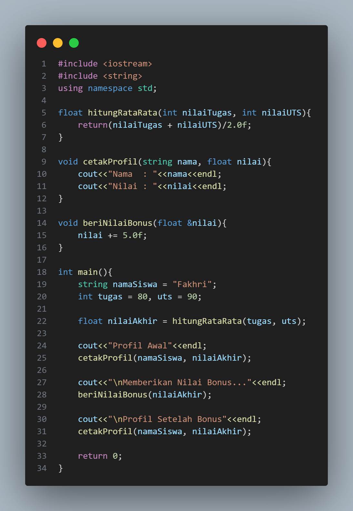

# Laporan Praktikum Struktur Data Modul 2

## 1. Nama, NIM, Kelas
- **Nama** : Fakhri Naabil Prasetyo
- **NIM**  : 103112400274
- **Kelas**: 12-IF-05

## 2. Motivasi Belajar Struktur Data
Saya memiliki dorongan kuat untuk mempelajari struktur data karena menyadari bahwa konsep ini adalah dasar utama dalam pemrograman. Seperti halnya bangunan yang membutuhkan fondasi kokoh, program yang kita buat juga membutuhkan struktur data agar dapat berjalan dengan baik.

## 3. Dasar Teori
Struktur data adalah cara untuk menyimpan dan mengorganisir data dalam komputer agar dapat digunakan secara efisien. Berikut adalah teori dasar mengenai Array, Pointer, dan Fungsi:
- **Konsep Array dan Pengolahan Data**
Array adalah struktur data yang digunakan untuk menyimpan banyak nilai dengan tipe data yang sama dalam satu variabel. Setiap elemen dalam array memiliki posisi atau indeks tertentu yang bisa diakses secara langsung, misalnya dengan arr[i] pada C++. Data dalam array tersimpan secara berurutan di memori, sehingga proses pengambilan dan pengolahan datanya menjadi lebih cepat. Array sangat berguna ketika kita ingin mengelola banyak data sekaligus, seperti daftar nilai siswa, stok barang, atau data penjualan. Dengan adanya array, kita tidak perlu membuat banyak variabel satu per satu.
Menurut Kusuma & Rahmadani (2023), struktur array merupakan dasar penting dalam pengelolaan data karena memungkinkan penyimpanan dan pengolahan informasi secara efisien serta teratur.

- **Pointer dan Manipulasi Memori**
Pointer adalah variabel yang berisi alamat memori dari variabel lain. Dengan pointer, kita dapat mengakses dan mengubah nilai variabel secara langsung melalui alamat memorinya, bukan dengan menyalin datanya. Cara ini membuat program lebih efisien dalam penggunaan memori dan lebih fleksibel saat memproses data. Santoso & Wirawan (2022) menyebutkan bahwa pemahaman pointer sangat penting untuk memahami bagaimana komputer mengatur memori serta bagaimana efisiensi manipulasi data dapat dicapai dalam bahasa pemrograman seperti C dan C++.

- **Fungsi dan Parameter Referensi**
Fungsi digunakan untuk membagi program menjadi beberapa bagian kecil yang memiliki tugas tertentu. Dengan begitu, kode menjadi lebih rapi dan mudah digunakan kembali. Dalam C++, fungsi dapat menerima parameter dengan dua cara: by value (nilai disalin) atau by reference (mengacu ke variabel asli). Jika menggunakan pass by reference, maka perubahan yang dilakukan di dalam fungsi akan langsung memengaruhi variabel aslinya. Hal ini membuat program lebih efisien dan mendukung prinsip modularitas, yaitu memecah program menjadi bagian-bagian yang saling bekerja sama.
Putri & Nugroho (2021) menjelaskan bahwa penggunaan parameter referensi dalam fungsi membantu meningkatkan efisiensi pengolahan data dan memperkuat konsep modular dalam pemrograman.

## 4. Guided
### 4.1 Guided 1

- **Penjelasan  :**
Program ini digunakan untuk menampilkan jumlah buku yang dibaca setiap hari selama seminggu dan menghitung totalnya. Data jumlah buku disimpan dalam array bukuPerHari, sedangkan variabel totalBuku digunakan untuk menampung total keseluruhan. Melalui perulangan for, program menampilkan jumlah buku yang dibaca setiap hari dan menambahkan nilainya ke total. Secara keseluruhan, program ini memanfaatkan array untuk menyimpan data dan loop for untuk menampilkan serta menghitung total buku secara otomatis.

- **Output  :**

### 4.2 Guided 2

- **Penjelasan  :**

Program ini digunakan untuk menampilkan harga awal produk, alamat memorinya, dan menghitung harga setelah diberi diskon menggunakan pointer. Variabel hargaProduk menyimpan nilai awal 50000, sedangkan pointer ptrHarga digunakan untuk menyimpan alamat memori dari variabel tersebut. Program menampilkan harga awal dan alamat memorinya, lalu memberikan diskon 10% melalui pointer dengan perintah *ptrHarga = *ptrHarga * 0.9;. Karena pointer terhubung langsung ke variabel aslinya, perubahan nilai otomatis terjadi pada hargaProduk. Hasil akhirnya, program menampilkan harga produk setelah diskon dengan nilai yang sudah berkurang.

- **Output  :**

### 4.3 Guided 3

- **Penjelasan  :**

Program ini digunakan untuk menampilkan profil siswa, menghitung rata-rata nilai, dan menambahkan bonus nilai menggunakan fungsi. Fungsi hitungRataRata() menghitung rata-rata dari nilai tugas dan UTS, sedangkan cetakProfil() menampilkan nama serta nilai siswa. Fungsi beriNilaiBonus() menambahkan nilai sebesar 5 poin dengan menggunakan parameter referensi, sehingga nilai asli ikut berubah. Di dalam main(), program menampilkan profil awal, memberikan bonus nilai, lalu menampilkan profil kembali setelah nilai diperbarui. Program ini menunjukkan cara penggunaan fungsi dan parameter referensi untuk memproses serta memperbarui data secara langsung.

- **Output  :**

## 5. Unguided
### 5.1 Unguided 1

- **Penjelasan  :**

Program ini dibuat untuk membantu toko buku menghitung dan mengelola stok. Data stok disimpan dalam array stokBuku. Program menampilkan stok awal, menghitung total stok dengan fungsi hitungTotal(), lalu mencari stok paling sedikit lewat fungsi cariStokTerkecil(). Buku dengan stok terendah mendapat bonus 10 buku. Setelah itu, stok baru ditampilkan lagi. Program ini menunjukkan penggunaan array, pointer, fungsi, dan prosedur untuk mengolah data dengan cara yang sederhana dan terstruktur.

- **Output  :**

## 6. Kesimpulan
Kesimpulannya, dari berbagai program C++ yang telah dibahas, dapat dipahami bahwa penguasaan konsep dasar seperti array, pointer, fungsi, referensi, dan operasi aritmetika sangat penting untuk membangun program yang baik. Array berfungsi untuk menyimpan banyak data dengan cara yang efisien, sedangkan pointer memungkinkan kita mengakses dan mengubah data langsung lewat alamat memori. Penggunaan parameter referensi pada fungsi membantu agar perubahan data bisa dilakukan tanpa menyalin nilai, sehingga program menjadi lebih efisien. Operasi aritmetika pada tipe data numerik juga berperan penting dalam menghasilkan perhitungan yang tepat dan akurat. Dengan memahami semua konsep ini, seorang programmer dapat membuat program yang lebih terstruktur, efisien, dan mampu menyelesaikan masalah komputasi dengan lebih efektif.

## 7. Referensi
1. Deitel, P. J., & Deitel, H. M. (2017). C++ How to Program (10th Edition). Pearson Education.
2. Malik, D. S. (2018). C++ Programming: From Problem Analysis to Program Design. Cengage Learning.
3. Stroustrup, B. (2013). The C++ Programming Language (4th Edition). Addison-Wesley.
4. Sutanta, E. (2011). Pemrograman C++ untuk Pemula dan Mahir. ANDI Offset.