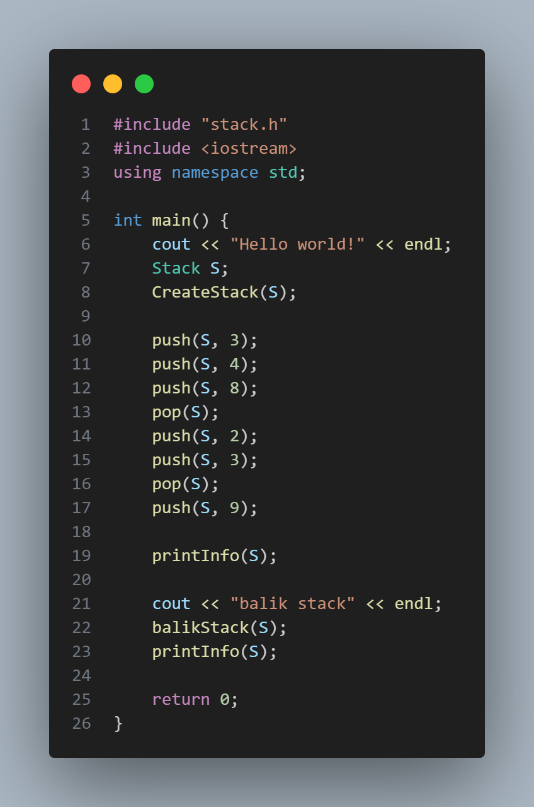
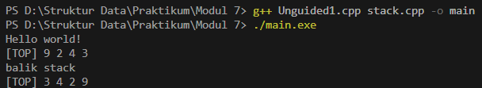
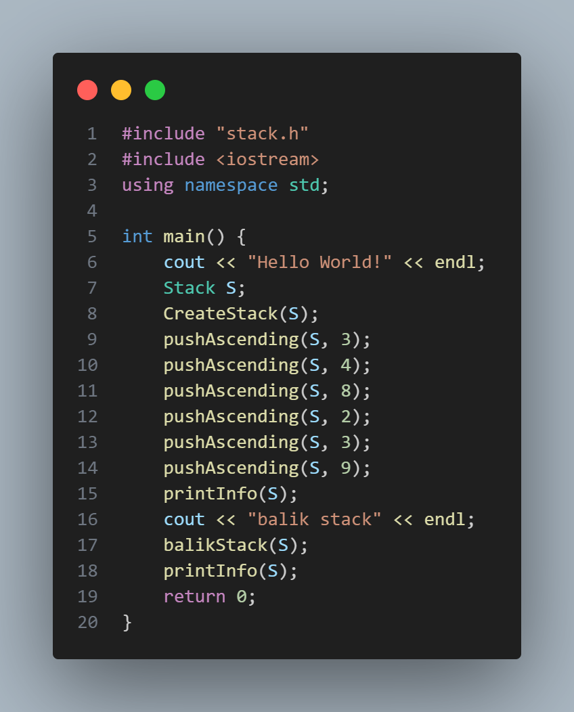
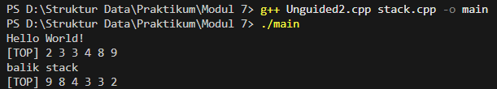
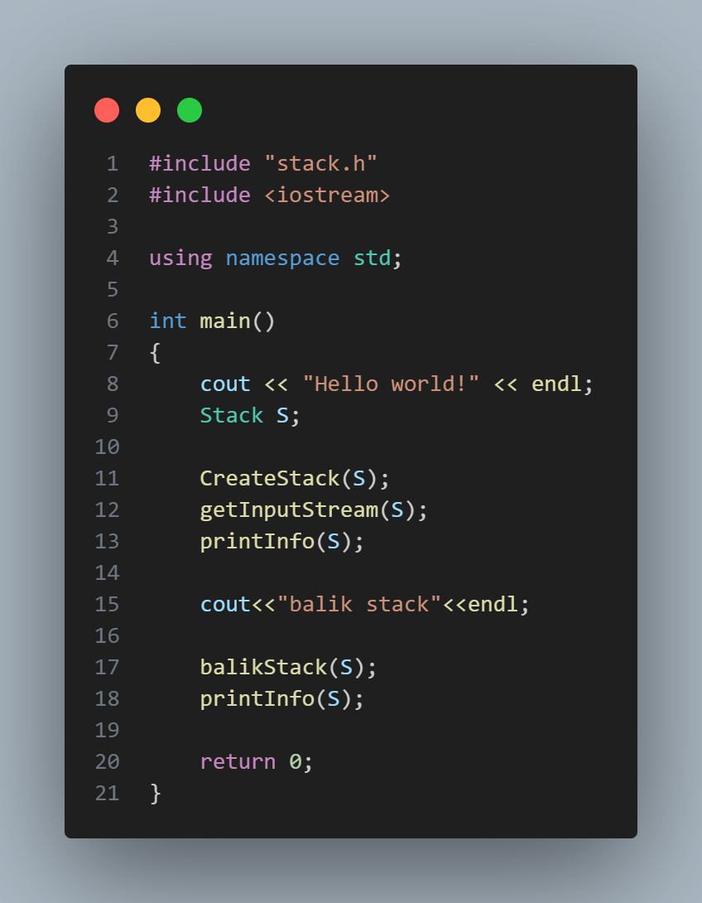
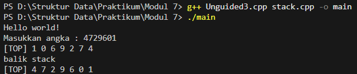

# Laporan Praktikum Struktur Data Modul 7

## 1. Nama, NIM, Kelas
- **Nama** : Fakhri Naabil Prasetyo
- **NIM**  : 103112400274
- **Kelas**: 12-IF-05

## 2. Motivasi Belajar Struktur Data
Saya memiliki dorongan kuat untuk mempelajari struktur data karena menyadari bahwa konsep ini adalah dasar utama dalam pemrograman. Seperti halnya bangunan yang membutuhkan fondasi kokoh, program yang kita buat juga membutuhkan struktur data agar dapat berjalan dengan baik.

## 3. Dasar Teori
Struktur data adalah metode untuk menyimpan serta mengorganisasi data sehingga dapat diolah secara efektif oleh program. Salah satu struktur data yang paling mudah dipahami namun sangat bermanfaat adalah stack. Stack bekerja dengan aturan LIFO (Last In, First Out), artinya data yang terakhir dimasukkan justru menjadi data yang pertama keluar. Karena sifatnya yang sederhana namun praktis, stack sering dipakai dalam berbagai situasi seperti proses pembalikan data, pengecekan kesesuaian tanda kurung dalam ekspresi matematika, hingga pengelolaan alur eksekusi fungsi rekursif.

### Berikut adalah Dasar Teori nya  :

- **1. Prinsip Kerja Operasi Dasar Stack (push dan pop)**
Dalam stack, terdapat dua operasi fundamental yaitu:
push() → menambahkan elemen baru ke bagian paling atas stack 
pop() → mengambil sekaligus menghapus elemen teratas 
Stack biasanya direpresentasikan menggunakan array dan variabel top sebagai penunjuk posisi elemen paling atas. Jika nilai top mencapai batas maksimum array, maka kondisi tersebut disebut overflow. Sebaliknya, jika top bernilai -1, maka stack dianggap underflow atau kosong.

- **2. Konsep pushAscending()**
Operasi pushAscending() merupakan pengembangan dari fungsi push biasa. Pada fungsi ini, setiap elemen baru yang dimasukkan akan ditempatkan di posisi yang menjaga agar nilai-nilai pada stack tetap tersusun secara menaik (ascending). Dengan demikian, data di dalam stack selalu berada dalam keadaan terurut meskipun proses memasukkan elemen dilakukan secara acak. Teknik ini berguna ketika program membutuhkan struktur stack yang tetap terorganisasi tanpa harus melakukan sorting terpisah.

- **3. Konsep getInputStream()**
Fungsi getInputStream() bertugas membaca data input dari pengguna satu per satu, biasanya berupa karakter, angka, atau simbol lain. Proses pembacaan dapat dilakukan menggunakan cin.get() hingga pengguna menekan tombol Enter sebagai tanda akhir input. Setiap karakter yang diterima dapat langsung dimasukkan ke stack untuk kemudian diproses lebih lanjut, misalnya untuk ditampilkan kembali atau dibalik urutannya.

- **4. Konsep balikStack()**
balikStack() adalah fungsi yang bertujuan membalik susunan elemen dalam stack. Teknik yang umum digunakan adalah dengan menyediakan satu stack sementara, lalu memindahkan elemen dari stack utama ke stack baru. Karena stack bekerja dengan konsep LIFO, proses pemindahan ini secara otomatis menghasilkan urutan yang terbalik. Metode ini menunjukkan bagaimana sifat dasar stack dapat dimanfaatkan untuk mengubah urutan data secara efektif.

- **5. Traversal dan Modularisasi pada Program Stack**
Untuk menampilkan isi stack, dilakukan proses traversal, yaitu menelusuri elemen mulai dari bagian paling atas hingga bagian paling bawah. Biasanya hal ini dilakukan melalui fungsi seperti printInfo(). Selain itu, setiap operasi seperti push, pop, pushAscending, dan balikStack dikelompokkan dalam fungsi terpisah agar program lebih rapi, mudah diuji, dan memudahkan pengembangan. Pendekatan modular ini merupakan praktik baik dalam pemrograman karena membuat kode lebih terstruktur dan mudah dirawat.

## 4. Guided
### 4.1 Guided 1 (stack.h)
.png)

- **Penjelasan  :**
File stack.h ini berisi definisi struktur data stack serta deklarasi fungsi-fungsi yang digunakan untuk mengoperasikannya. Bagian awal menggunakan header guard untuk mencegah file di-include lebih dari sekali. Konstanta MaxEl menentukan ukuran maksimum stack, sedangkan Nil digunakan sebagai tanda bahwa stack masih kosong. Tipe data elemen stack diberi alias infotype yang bertipe integer.
Struktur Stack terdiri dari array info sebagai tempat menyimpan data dan variabel top sebagai penunjuk elemen teratas. Setelah itu, terdapat deklarasi beberapa fungsi dasar seperti CreateStack untuk inisialisasi, isEmpty dan isFull untuk memeriksa kondisi stack, push dan pop untuk menambah dan mengambil elemen, serta printInfo untuk menampilkan isi stack.
Selain operasi dasar, terdapat juga fungsi tambahan yaitu balikStack untuk membalik isi stack, pushAscending untuk memasukkan data sambil mempertahankan urutan menaik, dan getInputStream untuk membaca input pengguna dan langsung memasukkannya ke stack.

### 4.2 Guided 2 (stack.cpp)
.png)

- **Penjelasan  :**
Kode stack.cpp berisi implementasi fungsi-fungsi pada struktur data stack. Fungsi createEmpty() mengatur top menjadi -1 sebagai tanda bahwa stack masih kosong. Fungsi isEmpty() mengecek apakah top bernilai -1, sedangkan isFull() mengecek apakah top telah mencapai kapasitas maksimal. Fungsi push() menambahkan data baru ke posisi teratas jika stack belum penuh, sementara pop() menghapus data dari posisi teratas jika stack tidak kosong. Terakhir, fungsi printStack() menampilkan seluruh isi stack dari elemen teratas hingga terbawah.

### 4.2 Guided 3 (main.cpp)
.png)

- **Penjelasan  :**
Program ini mulai dengan membuat sebuah objek Stack S, lalu memanggil CreateStack(S) untuk menginisialisasi stack agar kosong. Setelah itu, beberapa operasi push dan pop dilakukan untuk menambah dan menghapus elemen pada stack. Urutannya adalah: push 3, push 4, push 8, pop (menghapus 8), push 2, push 3, pop (menghapus 3), dan terakhir push 9.
Setelah semua operasi tersebut, program menampilkan isi stack awal melalui printInfo(S).
Kemudian program memanggil fungsi balikStack(S) untuk membalik urutan elemen dalam stack. Setelah proses pembalikan selesai, isi stack yang sudah terbalik kembali ditampilkan menggunakan printInfo(S).
Secara sederhana, kode ini mendemonstrasikan bagaimana stack dibuat, diisi, dimodifikasi, lalu dibalik, dan hasilnya ditampilkan ke layar.

- **Output Compile main.cpp :**
.png)

## 5. Unguided
### 5.1 Unguided 1

- **Penjelasan  :**
Program ini diawali dengan menampilkan tulisan "Hello world!" ke layar. Setelah itu, dibuat sebuah variabel bernama S yang berisi struktur data stack. Fungsi CreateStack(S) dipanggil untuk mengosongkan stack dan menyiapkannya agar siap digunakan.Selanjutnya, program melakukan beberapa operasi push dan pop untuk menambah dan menghapus data dari stack. Urutannya adalah:
push 3
push 4
push 8
pop (menghapus 8)
push 2
push 3
pop (menghapus 3)
push 9
Setelah rangkaian operasi tersebut, program memanggil printInfo(S) untuk menampilkan isi stack saat ini.
Kemudian program menuliskan "balik stack" sebagai penanda bahwa proses pembalikan dimulai. Fungsi balikStack(S) digunakan untuk membalik urutan isi stack. Setelah stack dibalik, printInfo(S) dipanggil lagi untuk menampilkan hasil akhirnya. Secara keseluruhan, kode ini menunjukkan cara membuat stack, mengisi datanya, memodifikasi isi melalui operasi push dan pop, lalu membalik isi stack dan menampilkannya ke layar.

- **Output  :**

### 5.2 Unguided 2

- **Penjelasan  :**
Program ini contoh penggunaan stack dengan fitur pushAscending, yaitu menambahkan elemen ke dalam stack secara berurutan dari nilai terkecil ke terbesar. Pertama, program menampilkan teks “Hello World!” lalu membuat stack kosong dengan CreateStack(S). Setelah itu, beberapa nilai seperti 3, 4, 8, 2, 3, dan 9 dimasukkan menggunakan pushAscending, sehingga elemen-elemen dalam stack otomatis tersusun naik berdasarkan nilainya. Fungsi printInfo(S) kemudian menampilkan isi stack. Selanjutnya, program menampilkan teks “balik stack” dan memanggil balikStack(S) untuk membalik urutan elemen di dalam stack, lalu hasil akhirnya kembali ditampilkan dengan printInfo(S). Program ini menunjukkan cara menambah elemen secara terurut naik serta membalik urutan stack dengan mudah

- **Output  :**

### 5.3 Unguided 3

- **Penjelasan  :**
Unguided3.cpp ini adalah program driver yang fokus utamanya adalah untuk menguji fungsionalitas getInputStream(S). Sama seperti yang lain, dia meng-include stack.h dan iostream. Di dalam main, setelah membuat dan menginisialisasi Stack S, program ini langsung memanggil getInputStream(S). Ini artinya, program akan berhenti sejenak dan meminta pengguna untuk mengetikkan serangkaian angka, yang kemudian akan diproses dan dimasukkan ke dalam stack oleh fungsi tersebut. Setelah stack terisi sesuai input pengguna, program memanggil printInfo(S) untuk menampilkan hasilnya. Sebagai langkah pengujian tambahan, program ini kemudian memanggil balikStack(S) untuk membalik isi stack yang baru saja diinput oleh pengguna, dan mencetaknya lagi dengan printInfo(S) untuk menunjukkan kondisi stack setelah dibalik.

- **Output  :**

## 6. Kesimpulan
Kesimpulannya, Secara keseluruhan enam kode tersebut membentuk satu rangkaian lengkap yang menunjukkan bagaimana struktur data Stack statis berbasis array didefinisikan, diimplementasikan, dan diuji. Pembagian filenya juga tersusun dengan rapi. Pada bagian stack.h, file ini berfungsi sebagai antarmuka yang menjelaskan bentuk struktur Stack—berisi array info[MaxEl] dan variabel TOP—serta mendeklarasikan seluruh fungsi yang akan digunakan di program. Selanjutnya, file stack.cpp menjadi tempat seluruh logika program dijalankan. Di dalamnya terdapat implementasi fungsi-fungsi dasar seperti Push, Pop, IsEmpty, dan IsFull, kemudian dilengkapi juga dengan fungsi tambahan seperti membalik isi stack, memasukkan elemen secara ascending, hingga membaca banyak input sekaligus. Sementara itu, empat file lainnya seperti main.cpp, Unguided1.cpp, Unguided2.cpp, dan Unguided3.cpp berperan sebagai program uji (driver). Tiap file memiliki fokus pengujian yang berbeda: main.cpp dan Unguided1.cpp mencoba operasi dasar stack serta pembalikan urutan, Unguided2.cpp khusus menguji insert dengan aturan ascending, dan Unguided3.cpp digunakan untuk menguji fungsi pembacaan input otomatis. Dengan pembagian tugas seperti ini, seluruh program menggambarkan proses lengkap mulai dari pembuatan struktur stack, implementasi fitur-fiturnya, hingga demonstrasi penggunaannya dalam berbagai skenario.

## 7. Referensi
1. GeeksforGeeks. “Stack Data Structure (Introduction and Implementation).” https://www.geeksforgeeks.org/stack-data-structure/
2. Mak, T., & Mitrović, S. (2024). Execution Efficiency of the use of Array and Linked-List Implementations of a Stack Abstract Data Types... in Methods of an Android Application. TEM Journal, 13(2), 1618–1632.
3. W3Schools. “C++ Functions.” https://www.w3schools.com/cpp/cpp_functions.asp
4. Setiyawan, D., & Simarmata, E. P. (2024). Penggunaan Struktur Data Stack dalam Pemrograman C++ dengan Pendekatan Array dan Linked List. JUTECH : Journal Education and Technology, 3(2), 116-123.