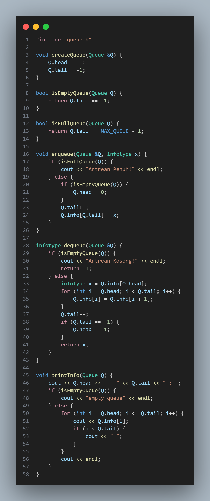
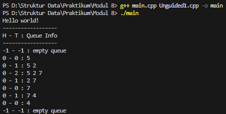
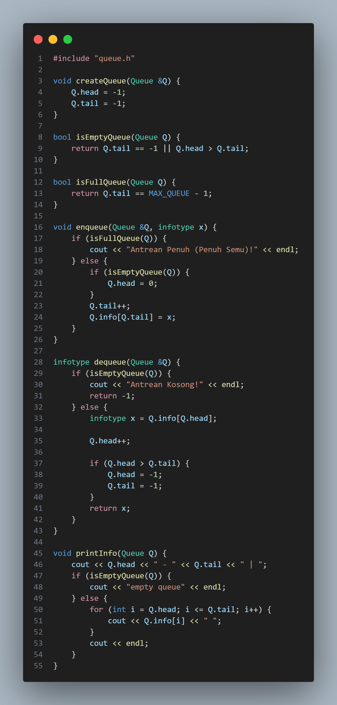
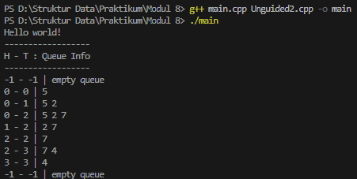
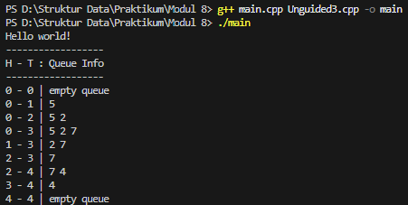

# Laporan Praktikum Struktur Data Modul 8

## 1. Nama, NIM, Kelas
- **Nama** : Fakhri Naabil Prasetyo
- **NIM**  : 103112400274
- **Kelas**: 12-IF-05

## 2. Motivasi Belajar Struktur Data
Saya memiliki dorongan kuat untuk mempelajari struktur data karena menyadari bahwa konsep ini adalah dasar utama dalam pemrograman. Seperti halnya bangunan yang membutuhkan fondasi kokoh, program yang kita buat juga membutuhkan struktur data agar dapat berjalan dengan baik.

## 3. Dasar Teori
Struktur data adalah metode untuk menyimpan serta mengorganisasi data sehingga dapat diolah secara efektif oleh program. Salah satu struktur data yang mudah dipahami namun berperan besar dalam berbagai proses komputasi adalah queue. Queue bekerja dengan prinsip FIFO (First In, First Out), yaitu data yang pertama kali masuk akan menjadi data yang pertama kali dikeluarkan. Dengan aturan seperti antrean pada kehidupan nyata, struktur ini sangat efektif digunakan ketika urutan kedatangan harus dihargai secara adil. Karena sifatnya tersebut, queue banyak diterapkan dalam berbagai kebutuhan seperti sistem antrean layanan, penjadwalan proses pada sistem operasi, pengiriman dan penerimaan data dalam jaringan, hingga algoritma pencarian seperti Breadth-First Search (BFS).

### Berikut adalah Dasar Teori nya  :

Queue atau antrean adalah struktur data linier yang mengikuti aturan FIFO (First-In, First-Out), artinya elemen yang masuk lebih dulu akan keluar lebih dulu. Dalam implementasinya biasanya digunakan dua penunjuk: head (menunjuk elemen paling depan yang akan di-dequeue) dan tail (menunjuk posisi tempat menambahkan elemen baru melalui operasi enqueue). Operasi dasar pada queue adalah enqueue untuk menambah elemen di tail dan dequeue untuk mengambil elemen dari head.
Salah satu cara sederhana membuat queue adalah memakai array statis dan dua variabel integer untuk head dan tail. Pada pendekatan paling dasar (sering disebut naive), head selalu dianggap berada di indeks 0 sehingga setiap kali terjadi dequeue, semua elemen yang tersisa digeser satu posisi ke kiri agar head tetap di indeks 0. Cara ini mudah diimplementasikan tetapi tidak efisien karena pergeseran masing-masing elemen membuat operasi dequeue berbiaya O(n).
Untuk memperbaiki hal tersebut, pendekatan kedua tidak melakukan shifting; cukup memajukan nilai head setiap kali dequeue sehingga penghapusan menjadi O(1). Namun pendekatan ini menimbulkan kondisi yang disebut penuh semu (pseudo-full): tail bisa mencapai akhir array padahal ada ruang kosong di awal akibat head yang telah bergeser, sehingga kapasitas array tidak dimanfaatkan penuh tanpa mekanisme tambahan.
Solusi umum dan paling efisien adalah Circular Queue (circular buffer). Ide dasarnya adalah memperlakukan array seolah-olah melingkar, sehingga ketika head atau tail mencapai indeks terakhir mereka dapat “melompat” kembali ke indeks 0 dengan operasi modulo ((index + 1) % size). Dengan cara ini enqueue dan dequeue keduanya dapat dilakukan dalam waktu O(1), tidak ada shifting, dan masalah penuh semu teratasi karena seluruh slot array dapat dipakai terus menerus. Pendekatan circular juga memerlukan sedikit penanganan ekstra untuk membedakan kondisi kosong dan penuh (misalnya menyimpan jumlah elemen atau menggunakan satu slot kosong sebagai indikator).

## 4. Guided
### 4.1 Guided 1 (queue.h)
.png)

- **Penjelasan  :**
Kode tersebut merupakan file header yang mendefinisikan struktur dan fungsi-fungsi dasar untuk membuat sebuah queue menggunakan array. Bagian awal berisi header guard untuk mencegah file di-include lebih dari sekali, serta pemanggilan pustaka <iostream>. Konstanta MAX_QUEUE menentukan ukuran maksimum antrean, sementara infotype didefinisikan sebagai tipe data elemen yang disimpan, yaitu integer.
Struktur Queue terdiri dari array info sebagai tempat menyimpan data, serta variabel head, tail, dan count yang masing-masing digunakan untuk menandai posisi elemen pertama, posisi penambahan elemen terakhir, dan jumlah elemen yang sedang ada dalam queue. Setelah itu, terdapat deklarasi beberapa fungsi penting: createQueue untuk menginisialisasi antrean, isEmptyQueue dan isFullQueue untuk mengecek kondisi queue, enqueue untuk menambah data, dequeue untuk menghapus data dari depan, serta printInfo untuk menampilkan isi antrean. Secara keseluruhan, file ini menyiapkan struktur dan operasi dasar yang diperlukan untuk mengelola queue pada program utama.

### 4.2 Guided 2 (queue.cpp)
.png)

- **Penjelasan  :**
Kode tersebut mengimplementasikan operasi-operasi dasar dari circular queue. Fungsi createQueue mengatur head, tail, dan count menjadi 0 sebagai tanda bahwa antrean masih kosong. Fungsi isEmpty mengembalikan nilai true jika count bernilai 0, sedangkan isFull mengembalikan true jika count sudah mencapai MAX_QUEUE.
Pada fungsi enqueue, data baru dimasukkan ke array pada posisi tail jika queue belum penuh. Setelah itu, nilai tail digeser ke indeks berikutnya menggunakan (tail + 1) % MAX_QUEUE, dan count ditambah satu. Jika antrean penuh, akan muncul pesan “Antrean Penuh!”.
Fungsi dequeue mengambil data pada posisi head jika queue tidak kosong. Data tersebut disimpan, lalu head digeser ke indeks berikutnya secara circular dan count dikurangi satu. Jika kosong, akan ditampilkan pesan “Antrean Kosong!” dan fungsi mengembalikan nilai -1.
Terakhir, printInfo mencetak seluruh isi queue. Ia mulai dari indeks head dan menampilkan elemen sebanyak count kali, dengan indeks yang terus bergerak secara circular menggunakan modulo. Fungsi ini menampilkan data dalam urutan antreannya saat ini.

### 4.2 Guided 3 (main.cpp)
.png)

- **Penjelasan  :**
Kode di atas adalah program utama yang digunakan untuk menguji fungsi-fungsi pada struktur data queue yang sudah dibuat sebelumnya. Program dimulai dengan menampilkan tulisan “Hello world!” di layar, lalu membuat sebuah objek queue bernama Q. Setelah itu, program menampilkan judul kecil sebagai pemisah output sebelum melakukan serangkaian operasi antrean.
Pertama, queue diinisialisasi menggunakan createQueue(Q) dan langsung ditampilkan isinya dengan printInfo(Q). Karena baru dibuat, isi queue masih kosong. Selanjutnya, program mulai menambahkan beberapa nilai ke dalam antrean menggunakan enqueue. Nilai 5, 2, dan 7 dimasukkan secara berurutan, dan setiap kali setelah memasukkan nilai, isi queue dicetak untuk melihat perubahan.
Program kemudian melakukan operasi dequeue beberapa kali untuk mengeluarkan elemen dari bagian depan antrean. Setiap penghapusan elemen juga diikuti oleh printInfo(Q) sehingga perubahan isi queue dapat diamati dari output. Setelah itu, nilai 4 kembali dimasukkan ke dalam antrean, lalu dicetak lagi. Program melanjutkan dengan dua kali dequeue terakhir untuk menghabiskan isi antrean sambil tetap menampilkan kondisi queue setelah setiap operasi.

- **Output Compile main.cpp :**

.png)

## 5. Unguided
### 5.1 Unguided 1

- **Penjelasan  :**
Kode ini mengimplementasikan struktur data Queue menggunakan array statis. Fungsi createQueue() digunakan untuk menginisialisasi antrian dengan mengatur head dan tail ke nilai -1, yang menandakan bahwa antrian masih kosong. Untuk mengecek kondisi antrian, terdapat dua fungsi: isEmptyQueue() yang mengembalikan true jika tail == -1, dan isFullQueue() yang memeriksa apakah tail sudah mencapai batas maksimal array (MAX_QUEUE - 1).
Operasi penambahan data dilakukan oleh fungsi enqueue(). Pertama, fungsi ini mengecek apakah antrian penuh; jika iya, program menampilkan pesan “Antrean Penuh!”. Jika tidak penuh, dan antrian masih kosong, maka head diset ke 0. Selanjutnya, tail ditambah satu dan data baru dimasukkan ke posisi tersebut.
Untuk menghapus data dari antrian digunakan fungsi dequeue(). Jika antrian kosong, ditampilkan pesan “Antrean Kosong!” dan fungsi mengembalikan -1. Tetapi jika ada data, elemen paling depan (info[head]) disimpan terlebih dahulu sebagai nilai yang akan dikembalikan. Setelah itu seluruh elemen digeser satu posisi ke kiri agar antrian tetap berurutan. Kemudian tail dikurangi satu, dan jika setelah penghapusan tail menjadi -1, maka head juga dikembalikan ke -1 sehingga status antrian kembali kosong.
Terakhir, fungsi printInfo() menampilkan posisi head dan tail, kemudian mencetak isi antrian. Jika antrian kosong, ditampilkan teks “empty queue”. Jika tidak, fungsi akan mencetak semua elemen dari head hingga tail secara berurutan pada satu baris.

- **Output  :**

### 5.2 Unguided 2

- **Penjelasan  :**
Fungsi createQueue() bertugas menginisialisasi queue agar siap dipakai dengan mengatur head = -1 dan tail = -1. Selanjutnya, fungsi isEmptyQueue() digunakan untuk mengecek apakah queue kosong. Queue dianggap kosong ketika tail == -1 atau ketika posisi head sudah melewati tail akibat operasi dequeue.
Fungsi isFullQueue() mengecek apakah queue sudah penuh, yaitu ketika tail telah mencapai batas maksimum array (MAX_QUEUE - 1).
Operasi enqueue() digunakan untuk menambahkan data ke dalam queue. Pertama, fungsi mengecek apakah queue sudah penuh. Jika belum, program akan mengecek apakah queue masih kosong. Jika kosong, head di-set ke 0. Setelah itu, tail dinaikkan satu posisi dan data baru dimasukkan ke array pada posisi tail.
Untuk menghapus data, digunakan fungsi dequeue(). Fungsi ini pertama mengecek apakah queue kosong. Jika tidak kosong, fungsi mengambil nilai pada posisi head, lalu head dinaikkan satu. Jika setelah menaikkan head ternyata posisinya sudah melewati tail, artinya queue kembali kosong, sehingga head dan tail dikembalikan menjadi -1. Nilai yang dikeluarkan kemudian dikembalikan oleh fungsi.
Terakhir, fungsi printInfo() digunakan untuk menampilkan isi queue. Fungsi ini mencetak posisi head dan tail terlebih dahulu, lalu menampilkan seluruh elemen dari head hingga tail. Jika queue kosong, program hanya menampilkan pesan "empty queue".

- **Output  :**

### 5.3 Unguided 3

- **Penjelasan  :**
Program ini mengimplementasikan circular queue menggunakan array. Di awal, fungsi createQueue() bertugas menginisialisasi antrian dengan mengatur head dan tail ke posisi 0 yang berarti antrian masih kosong.
Selanjutnya, fungsi isEmptyQueue() digunakan untuk mengecek apakah antrian kosong, yaitu jika nilai head sama dengan tail. Ada juga fungsi isFullQueue() untuk mengecek apakah antrian penuh, yaitu ketika (tail + 1) % MAX_QUEUE bertemu dengan posisi head.
Fungsi enqueue() berfungsi menambah data ke dalam queue. Jika antrian penuh, program menampilkan pesan "Antrian Penuh!". Jika tidak penuh, data akan dimasukkan ke posisi tail, kemudian tail digeser ke indeks berikutnya dengan operasi (tail + 1) % MAX_QUEUE.
Sebaliknya, fungsi dequeue() dipakai untuk mengambil atau mengeluarkan data dari posisi head. Jika antrian kosong, fungsi menampilkan “Antrian Kosong!” dan mengembalikan -1. Jika ada data, nilai pada posisi head diambil, lalu head digeser ke indeks berikutnya dengan perhitungan circular.
Terakhir, fungsi printInfo() digunakan untuk menampilkan isi queue. Program mencetak posisi head dan tail lalu memeriksa apakah queue kosong. Jika kosong, akan muncul pesan “empty queue”. Jika tidak, program mencetak semua data dari head hingga tail menggunakan perhitungan indeks melingkar.

- **Output  :**

## 6. Kesimpulan
Berdasarkan hasil pengerjaan dan analisis program queue di atas, saya dapat menyimpulkan bahwa tujuan pembelajaran mengenai penerapan struktur data Queue (Antrian) telah berhasil dipahami. Melalui implementasi fungsi-fungsi seperti createQueue, enqueue, dequeue, isEmptyQueue, isFullQueue, dan printInfo, saya dapat melihat bagaimana data dikelola dengan prinsip FIFO (First In, First Out), di mana elemen yang pertama masuk akan menjadi elemen yang pertama keluar.
Program ini menggunakan queue linier berbasis array, sehingga setiap kali terjadi operasi dequeue, elemen-elemen di dalam queue perlu digeser ke depan atau pointer head dinaikkan. Dari proses tersebut, saya memahami bagaimana kondisi queue dapat berubah dari kosong menjadi terisi, penuh, lalu kembali kosong setelah semua elemen dikeluarkan. Selain itu, penggunaan fungsi pengecekan seperti isEmptyQueue dan isFullQueue membantu menjaga agar operasi enqueue dan dequeue berjalan dengan aman tanpa melampaui batas.
Struktur fungsi yang tertata juga membuat program lebih mudah dibaca dan dipahami, serta mencerminkan konsep modularisasi dalam pemrograman. Secara keseluruhan, praktikum ini memberikan pemahaman yang baik mengenai cara kerja queue linier dan implementasinya dalam bahasa C++, terutama terkait manajemen data menggunakan indeks head dan tail.

## 7. Referensi
1. Weiss, M. A. (2014). Data Structures and Algorithm Analysis in C++. Pearson.
2. Lipschutz, S. (2011). Schaum’s Outline of Data Structures with C++. McGraw-Hill.
3. Goodrich, M. T., Tamassia, R., & Mount, D. (2011). Data Structures and Algorithms in C++. Wiley.
4. GeeksforGeeks. “Queue Data Structure.” https://www.geeksforgeeks.org/queue-data-structure/
5. Programiz. “Queue Data Structure.” https://www.programiz.com/dsa/queue